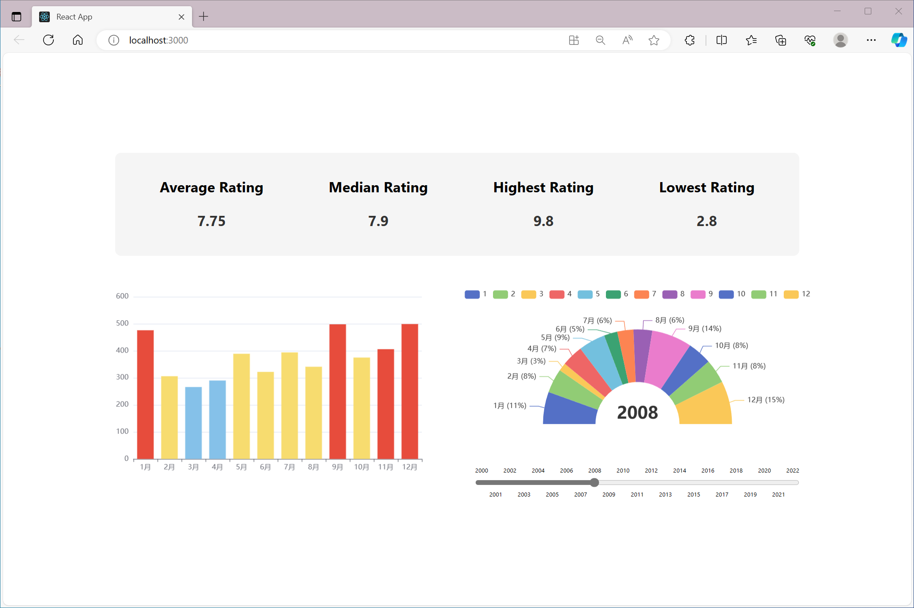

# Project Overview

This project is an academic assignment designed to showcase data visualization capabilities using advanced programming techniques. The primary objective is to effectively present various statistical insights derived from a movie dataset. The project is structured into three main components, each focusing on different aspects of data representation:

1. **Movie Rating Analysis**: This module visualizes key statistical measures such as average, median, highest, and lowest movie ratings. The visualization is based on the 'rating' attribute from the dataset, offering an insightful overview of movie ratings distribution.

2. **Movie Release Trends**: This section emphasizes the temporal distribution of movie releases. It statistically analyzes and displays the number of movies released each month, drawing on the 'release date' attribute from the dataset. This part aims to provide a clear understanding of monthly movie release patterns.

3. **Expanded Monthly Insights**: As an extension, this segment delves into the detailed monthly breakdown of the movie releases per year. It employs interactive tooltips to reveal more granular data, such as average ratings, the highest and lowest-rated movies each month, thereby offering a comprehensive perspective on monthly movie release quality.



The project is assured to be fully operational, with the dataset being a meticulously cleaned and structured JSON file, ready for direct integration and utilization.

## Frontend Implementation

The frontend is developed using **React**, coupled with **ECharts** for powerful and interactive data visualization. The choice of React facilitates a modular and efficient UI development approach, while ECharts offers a rich set of features for creating visually appealing and interactive charts. To start the frontend server, which defaults to port 3000, use the following commands:

```shell
npm install
npm start
```

For port customization, please adjust the settings in the backend CORS configuration accordingly.

## Backend Architecture

The backend is powered by **Spring Boot** and utilizes **MongoTemplate** for database operations, ensuring a robust and scalable server-side solution. The backend setup requires specific configurations in the `application.properties` file as detailed below:

```java
server.port=8082 // Server port number

spring.data.mongodb.authentication-database=admin // Database name for authentication purposes
spring.data.mongodb.database=NoSql-Experiment // Name of the primary database in use
spring.data.mongodb.username=admin // Database username
spring.data.mongodb.password=123456 // Database password
spring.data.mongodb.host=localhost // Address of the MongoDB service
spring.data.mongodb.port=27017 // Port number for MongoDB
```

This configuration ensures secure and efficient database interactions, laying the foundation for reliable data processing and API responses.

---

This project stands as a testament to the integration of modern web technologies in data visualization and backend efficiency, presenting a comprehensive and user-friendly interface for data analysis.